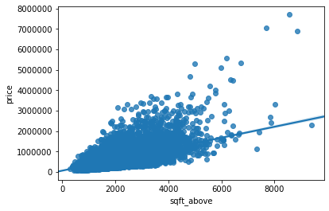

```python
import pandas as pd
import matplotlib.pyplot as plt
import numpy as np
import seaborn as sns
from sklearn.pipeline import Pipeline
from sklearn.preprocessing import StandardScaler,PolynomialFeatures
%matplotlib inline
```


```python
file_name='https://s3-api.us-geo.objectstorage.softlayer.net/cf-courses-data/CognitiveClass/DA0101EN/coursera/project/kc_house_data_NaN.csv'
df=pd.read_csv(file_name)
```


```python
df.dtypes
```


    Unnamed: 0         int64
    id                 int64
    date              object
    price            float64
    bedrooms         float64
    bathrooms        float64
    sqft_living        int64
    sqft_lot           int64
    floors           float64
    waterfront         int64
    view               int64
    condition          int64
    grade              int64
    sqft_above         int64
    sqft_basement      int64
    yr_built           int64
    yr_renovated       int64
    zipcode            int64
    lat              float64
    long             float64
    sqft_living15      int64
    sqft_lot15         int64
    dtype: object


```python
df.describe()
```


<div>
<style scoped>
    .dataframe tbody tr th:only-of-type {
        vertical-align: middle;
    }

    .dataframe tbody tr th {
        vertical-align: top;
    }

    .dataframe thead th {
        text-align: right;
    }
</style>
<table border="1" class="dataframe">
  <thead>
    <tr style="text-align: right;">
      <th></th>
      <th>Unnamed: 0</th>
      <th>id</th>
      <th>price</th>
      <th>bedrooms</th>
      <th>bathrooms</th>
      <th>sqft_living</th>
      <th>sqft_lot</th>
      <th>floors</th>
      <th>waterfront</th>
      <th>view</th>
      <th>...</th>
      <th>grade</th>
      <th>sqft_above</th>
      <th>sqft_basement</th>
      <th>yr_built</th>
      <th>yr_renovated</th>
      <th>zipcode</th>
      <th>lat</th>
      <th>long</th>
      <th>sqft_living15</th>
      <th>sqft_lot15</th>
    </tr>
  </thead>
  <tbody>
    <tr>
      <th>count</th>
      <td>21613.00000</td>
      <td>2.161300e+04</td>
      <td>2.161300e+04</td>
      <td>21600.000000</td>
      <td>21603.000000</td>
      <td>21613.000000</td>
      <td>2.161300e+04</td>
      <td>21613.000000</td>
      <td>21613.000000</td>
      <td>21613.000000</td>
      <td>...</td>
      <td>21613.000000</td>
      <td>21613.000000</td>
      <td>21613.000000</td>
      <td>21613.000000</td>
      <td>21613.000000</td>
      <td>21613.000000</td>
      <td>21613.000000</td>
      <td>21613.000000</td>
      <td>21613.000000</td>
      <td>21613.000000</td>
    </tr>
    <tr>
      <th>mean</th>
      <td>10806.00000</td>
      <td>4.580302e+09</td>
      <td>5.400881e+05</td>
      <td>3.372870</td>
      <td>2.115736</td>
      <td>2079.899736</td>
      <td>1.510697e+04</td>
      <td>1.494309</td>
      <td>0.007542</td>
      <td>0.234303</td>
      <td>...</td>
      <td>7.656873</td>
      <td>1788.390691</td>
      <td>291.509045</td>
      <td>1971.005136</td>
      <td>84.402258</td>
      <td>98077.939805</td>
      <td>47.560053</td>
      <td>-122.213896</td>
      <td>1986.552492</td>
      <td>12768.455652</td>
    </tr>
    <tr>
      <th>std</th>
      <td>6239.28002</td>
      <td>2.876566e+09</td>
      <td>3.671272e+05</td>
      <td>0.926657</td>
      <td>0.768996</td>
      <td>918.440897</td>
      <td>4.142051e+04</td>
      <td>0.539989</td>
      <td>0.086517</td>
      <td>0.766318</td>
      <td>...</td>
      <td>1.175459</td>
      <td>828.090978</td>
      <td>442.575043</td>
      <td>29.373411</td>
      <td>401.679240</td>
      <td>53.505026</td>
      <td>0.138564</td>
      <td>0.140828</td>
      <td>685.391304</td>
      <td>27304.179631</td>
    </tr>
    <tr>
      <th>min</th>
      <td>0.00000</td>
      <td>1.000102e+06</td>
      <td>7.500000e+04</td>
      <td>1.000000</td>
      <td>0.500000</td>
      <td>290.000000</td>
      <td>5.200000e+02</td>
      <td>1.000000</td>
      <td>0.000000</td>
      <td>0.000000</td>
      <td>...</td>
      <td>1.000000</td>
      <td>290.000000</td>
      <td>0.000000</td>
      <td>1900.000000</td>
      <td>0.000000</td>
      <td>98001.000000</td>
      <td>47.155900</td>
      <td>-122.519000</td>
      <td>399.000000</td>
      <td>651.000000</td>
    </tr>
    <tr>
      <th>25%</th>
      <td>5403.00000</td>
      <td>2.123049e+09</td>
      <td>3.219500e+05</td>
      <td>3.000000</td>
      <td>1.750000</td>
      <td>1427.000000</td>
      <td>5.040000e+03</td>
      <td>1.000000</td>
      <td>0.000000</td>
      <td>0.000000</td>
      <td>...</td>
      <td>7.000000</td>
      <td>1190.000000</td>
      <td>0.000000</td>
      <td>1951.000000</td>
      <td>0.000000</td>
      <td>98033.000000</td>
      <td>47.471000</td>
      <td>-122.328000</td>
      <td>1490.000000</td>
      <td>5100.000000</td>
    </tr>
    <tr>
      <th>50%</th>
      <td>10806.00000</td>
      <td>3.904930e+09</td>
      <td>4.500000e+05</td>
      <td>3.000000</td>
      <td>2.250000</td>
      <td>1910.000000</td>
      <td>7.618000e+03</td>
      <td>1.500000</td>
      <td>0.000000</td>
      <td>0.000000</td>
      <td>...</td>
      <td>7.000000</td>
      <td>1560.000000</td>
      <td>0.000000</td>
      <td>1975.000000</td>
      <td>0.000000</td>
      <td>98065.000000</td>
      <td>47.571800</td>
      <td>-122.230000</td>
      <td>1840.000000</td>
      <td>7620.000000</td>
    </tr>
    <tr>
      <th>75%</th>
      <td>16209.00000</td>
      <td>7.308900e+09</td>
      <td>6.450000e+05</td>
      <td>4.000000</td>
      <td>2.500000</td>
      <td>2550.000000</td>
      <td>1.068800e+04</td>
      <td>2.000000</td>
      <td>0.000000</td>
      <td>0.000000</td>
      <td>...</td>
      <td>8.000000</td>
      <td>2210.000000</td>
      <td>560.000000</td>
      <td>1997.000000</td>
      <td>0.000000</td>
      <td>98118.000000</td>
      <td>47.678000</td>
      <td>-122.125000</td>
      <td>2360.000000</td>
      <td>10083.000000</td>
    </tr>
    <tr>
      <th>max</th>
      <td>21612.00000</td>
      <td>9.900000e+09</td>
      <td>7.700000e+06</td>
      <td>33.000000</td>
      <td>8.000000</td>
      <td>13540.000000</td>
      <td>1.651359e+06</td>
      <td>3.500000</td>
      <td>1.000000</td>
      <td>4.000000</td>
      <td>...</td>
      <td>13.000000</td>
      <td>9410.000000</td>
      <td>4820.000000</td>
      <td>2015.000000</td>
      <td>2015.000000</td>
      <td>98199.000000</td>
      <td>47.777600</td>
      <td>-121.315000</td>
      <td>6210.000000</td>
      <td>871200.000000</td>
    </tr>
  </tbody>
</table>
<p>8 rows × 21 columns</p>
</div>


```python

df.drop(['id', 'Unnamed: 0'], axis=1, inplace = True)
df.describe()
```


<div>
<style scoped>
    .dataframe tbody tr th:only-of-type {
        vertical-align: middle;
    }

    .dataframe tbody tr th {
        vertical-align: top;
    }

    .dataframe thead th {
        text-align: right;
    }
</style>
<table border="1" class="dataframe">
  <thead>
    <tr style="text-align: right;">
      <th></th>
      <th>price</th>
      <th>bedrooms</th>
      <th>bathrooms</th>
      <th>sqft_living</th>
      <th>sqft_lot</th>
      <th>floors</th>
      <th>waterfront</th>
      <th>view</th>
      <th>condition</th>
      <th>grade</th>
      <th>sqft_above</th>
      <th>sqft_basement</th>
      <th>yr_built</th>
      <th>yr_renovated</th>
      <th>zipcode</th>
      <th>lat</th>
      <th>long</th>
      <th>sqft_living15</th>
      <th>sqft_lot15</th>
    </tr>
  </thead>
  <tbody>
    <tr>
      <th>count</th>
      <td>2.161300e+04</td>
      <td>21600.000000</td>
      <td>21603.000000</td>
      <td>21613.000000</td>
      <td>2.161300e+04</td>
      <td>21613.000000</td>
      <td>21613.000000</td>
      <td>21613.000000</td>
      <td>21613.000000</td>
      <td>21613.000000</td>
      <td>21613.000000</td>
      <td>21613.000000</td>
      <td>21613.000000</td>
      <td>21613.000000</td>
      <td>21613.000000</td>
      <td>21613.000000</td>
      <td>21613.000000</td>
      <td>21613.000000</td>
      <td>21613.000000</td>
    </tr>
    <tr>
      <th>mean</th>
      <td>5.400881e+05</td>
      <td>3.372870</td>
      <td>2.115736</td>
      <td>2079.899736</td>
      <td>1.510697e+04</td>
      <td>1.494309</td>
      <td>0.007542</td>
      <td>0.234303</td>
      <td>3.409430</td>
      <td>7.656873</td>
      <td>1788.390691</td>
      <td>291.509045</td>
      <td>1971.005136</td>
      <td>84.402258</td>
      <td>98077.939805</td>
      <td>47.560053</td>
      <td>-122.213896</td>
      <td>1986.552492</td>
      <td>12768.455652</td>
    </tr>
    <tr>
      <th>std</th>
      <td>3.671272e+05</td>
      <td>0.926657</td>
      <td>0.768996</td>
      <td>918.440897</td>
      <td>4.142051e+04</td>
      <td>0.539989</td>
      <td>0.086517</td>
      <td>0.766318</td>
      <td>0.650743</td>
      <td>1.175459</td>
      <td>828.090978</td>
      <td>442.575043</td>
      <td>29.373411</td>
      <td>401.679240</td>
      <td>53.505026</td>
      <td>0.138564</td>
      <td>0.140828</td>
      <td>685.391304</td>
      <td>27304.179631</td>
    </tr>
    <tr>
      <th>min</th>
      <td>7.500000e+04</td>
      <td>1.000000</td>
      <td>0.500000</td>
      <td>290.000000</td>
      <td>5.200000e+02</td>
      <td>1.000000</td>
      <td>0.000000</td>
      <td>0.000000</td>
      <td>1.000000</td>
      <td>1.000000</td>
      <td>290.000000</td>
      <td>0.000000</td>
      <td>1900.000000</td>
      <td>0.000000</td>
      <td>98001.000000</td>
      <td>47.155900</td>
      <td>-122.519000</td>
      <td>399.000000</td>
      <td>651.000000</td>
    </tr>
    <tr>
      <th>25%</th>
      <td>3.219500e+05</td>
      <td>3.000000</td>
      <td>1.750000</td>
      <td>1427.000000</td>
      <td>5.040000e+03</td>
      <td>1.000000</td>
      <td>0.000000</td>
      <td>0.000000</td>
      <td>3.000000</td>
      <td>7.000000</td>
      <td>1190.000000</td>
      <td>0.000000</td>
      <td>1951.000000</td>
      <td>0.000000</td>
      <td>98033.000000</td>
      <td>47.471000</td>
      <td>-122.328000</td>
      <td>1490.000000</td>
      <td>5100.000000</td>
    </tr>
    <tr>
      <th>50%</th>
      <td>4.500000e+05</td>
      <td>3.000000</td>
      <td>2.250000</td>
      <td>1910.000000</td>
      <td>7.618000e+03</td>
      <td>1.500000</td>
      <td>0.000000</td>
      <td>0.000000</td>
      <td>3.000000</td>
      <td>7.000000</td>
      <td>1560.000000</td>
      <td>0.000000</td>
      <td>1975.000000</td>
      <td>0.000000</td>
      <td>98065.000000</td>
      <td>47.571800</td>
      <td>-122.230000</td>
      <td>1840.000000</td>
      <td>7620.000000</td>
    </tr>
    <tr>
      <th>75%</th>
      <td>6.450000e+05</td>
      <td>4.000000</td>
      <td>2.500000</td>
      <td>2550.000000</td>
      <td>1.068800e+04</td>
      <td>2.000000</td>
      <td>0.000000</td>
      <td>0.000000</td>
      <td>4.000000</td>
      <td>8.000000</td>
      <td>2210.000000</td>
      <td>560.000000</td>
      <td>1997.000000</td>
      <td>0.000000</td>
      <td>98118.000000</td>
      <td>47.678000</td>
      <td>-122.125000</td>
      <td>2360.000000</td>
      <td>10083.000000</td>
    </tr>
    <tr>
      <th>max</th>
      <td>7.700000e+06</td>
      <td>33.000000</td>
      <td>8.000000</td>
      <td>13540.000000</td>
      <td>1.651359e+06</td>
      <td>3.500000</td>
      <td>1.000000</td>
      <td>4.000000</td>
      <td>5.000000</td>
      <td>13.000000</td>
      <td>9410.000000</td>
      <td>4820.000000</td>
      <td>2015.000000</td>
      <td>2015.000000</td>
      <td>98199.000000</td>
      <td>47.777600</td>
      <td>-121.315000</td>
      <td>6210.000000</td>
      <td>871200.000000</td>
    </tr>
  </tbody>
</table>
</div>


```python
mean=df['bedrooms'].mean()
df['bedrooms'].replace(np.nan,mean, inplace=True)
```


```python

mean=df['bathrooms'].mean()
df['bathrooms'].replace(np.nan,mean, inplace=True)
```


```python

df["floors"].value_counts().to_frame()
```


<div>
<style scoped>
    .dataframe tbody tr th:only-of-type {
        vertical-align: middle;
    }

    .dataframe tbody tr th {
        vertical-align: top;
    }

    .dataframe thead th {
        text-align: right;
    }
</style>
<table border="1" class="dataframe">
  <thead>
    <tr style="text-align: right;">
      <th></th>
      <th>floors</th>
    </tr>
  </thead>
  <tbody>
    <tr>
      <th>1.0</th>
      <td>10680</td>
    </tr>
    <tr>
      <th>2.0</th>
      <td>8241</td>
    </tr>
    <tr>
      <th>1.5</th>
      <td>1910</td>
    </tr>
    <tr>
      <th>3.0</th>
      <td>613</td>
    </tr>
    <tr>
      <th>2.5</th>
      <td>161</td>
    </tr>
    <tr>
      <th>3.5</th>
      <td>8</td>
    </tr>
  </tbody>
</table>
</div>


```python
sns.boxplot(x="waterfront", y="price", data=df)
```


    <matplotlib.axes._subplots.AxesSubplot at 0x7f43c06a7e48>


```python
sns.regplot(x="sqft_above", y="price", data=df)
```


    <matplotlib.axes._subplots.AxesSubplot at 0x7f43c04bb358>





```python
df.corr()['price'].sort_values()
```


    zipcode         -0.053203
    long             0.021626
    condition        0.036362
    yr_built         0.054012
    sqft_lot15       0.082447
    sqft_lot         0.089661
    yr_renovated     0.126434
    floors           0.256794
    waterfront       0.266369
    lat              0.307003
    bedrooms         0.308797
    sqft_basement    0.323816
    view             0.397293
    bathrooms        0.525738
    sqft_living15    0.585379
    sqft_above       0.605567
    grade            0.667434
    sqft_living      0.702035
    price            1.000000
    Name: price, dtype: float64


```python
import matplotlib.pyplot as plt
from sklearn.linear_model import LinearRegression
```


```python

X = df[['long']]
Y = df['price']
lm = LinearRegression()
lm
lm.fit(X,Y)
lm.score(X, Y)
```


    0.00046769430149007363


```python

X = df[['sqft_living']]
Y = df['price']
lm1 = LinearRegression()
lm1
lm1.fit(X,Y)
print('The R-square is: ', lm1.score(X, Y))
```

    The R-square is:  0.49285321790379316


```python

features =df[["floors", "waterfront","lat" ,"bedrooms" ,"sqft_basement" ,"view" ,"bathrooms","sqft_living15","sqft_above","grade","sqft_living"]]
```


```python
lm1.fit(features, df['price'])
print('The R-square is: ', lm1.score(features,df['price']))
```

    The R-square is:  0.6576527411217378


```python
Input=[('scale',StandardScaler()),('polynomial', PolynomialFeatures(include_bias=False)),('model',LinearRegression())]
```


```python
pipe=Pipeline(Input)
pipe
```


    Pipeline(memory=None,
         steps=[('scale', StandardScaler(copy=True, with_mean=True, with_std=True)), ('polynomial', PolynomialFeatures(degree=2, include_bias=False, interaction_only=False)), ('model', LinearRegression(copy_X=True, fit_intercept=True, n_jobs=None,
             normalize=False))])


```python
pipe.fit(X,Y)
```

    /home/jupyterlab/conda/envs/python/lib/python3.6/site-packages/sklearn/preprocessing/data.py:625: DataConversionWarning: Data with input dtype int64 were all converted to float64 by StandardScaler.
      return self.partial_fit(X, y)
    /home/jupyterlab/conda/envs/python/lib/python3.6/site-packages/sklearn/base.py:465: DataConversionWarning: Data with input dtype int64 were all converted to float64 by StandardScaler.
      return self.fit(X, y, **fit_params).transform(X)


    Pipeline(memory=None,
         steps=[('scale', StandardScaler(copy=True, with_mean=True, with_std=True)), ('polynomial', PolynomialFeatures(degree=2, include_bias=False, interaction_only=False)), ('model', LinearRegression(copy_X=True, fit_intercept=True, n_jobs=None,
             normalize=False))])


```python
pipe.score(X,Y)
```

    /home/jupyterlab/conda/envs/python/lib/python3.6/site-packages/sklearn/pipeline.py:511: DataConversionWarning: Data with input dtype int64 were all converted to float64 by StandardScaler.
      Xt = transform.transform(Xt)


    0.5327430940591443


```python

pipe.fit(features,Y)
ypipe=pipe.predict(features)
lm1.fit(features, Y)
print('The R-square is: ', lm.score(features, Y))
```

    /home/jupyterlab/conda/envs/python/lib/python3.6/site-packages/sklearn/preprocessing/data.py:625: DataConversionWarning: Data with input dtype int64, float64 were all converted to float64 by StandardScaler.
      return self.partial_fit(X, y)
    /home/jupyterlab/conda/envs/python/lib/python3.6/site-packages/sklearn/base.py:465: DataConversionWarning: Data with input dtype int64, float64 were all converted to float64 by StandardScaler.
      return self.fit(X, y, **fit_params).transform(X)
    /home/jupyterlab/conda/envs/python/lib/python3.6/site-packages/sklearn/pipeline.py:331: DataConversionWarning: Data with input dtype int64, float64 were all converted to float64 by StandardScaler.
      Xt = transform.transform(Xt)


    ---------------------------------------------------------------------------

    ValueError                                Traceback (most recent call last)

    <ipython-input-21-4f6fb416861e> in <module>
          2 ypipe=pipe.predict(features)
          3 lm1.fit(features, Y)
    ----> 4 print('The R-square is: ', lm.score(features, Y))
    

    ~/conda/envs/python/lib/python3.6/site-packages/sklearn/base.py in score(self, X, y, sample_weight)
        326 
        327         from .metrics import r2_score
    --> 328         return r2_score(y, self.predict(X), sample_weight=sample_weight,
        329                         multioutput='variance_weighted')
        330 


    ~/conda/envs/python/lib/python3.6/site-packages/sklearn/linear_model/base.py in predict(self, X)
        211             Returns predicted values.
        212         """
    --> 213         return self._decision_function(X)
        214 
        215     _preprocess_data = staticmethod(_preprocess_data)


    ~/conda/envs/python/lib/python3.6/site-packages/sklearn/linear_model/base.py in _decision_function(self, X)
        196         X = check_array(X, accept_sparse=['csr', 'csc', 'coo'])
        197         return safe_sparse_dot(X, self.coef_.T,
    --> 198                                dense_output=True) + self.intercept_
        199 
        200     def predict(self, X):


    ~/conda/envs/python/lib/python3.6/site-packages/sklearn/utils/extmath.py in safe_sparse_dot(a, b, dense_output)
        171         return ret
        172     else:
    --> 173         return np.dot(a, b)
        174 
        175 


    ValueError: shapes (21613,11) and (1,) not aligned: 11 (dim 1) != 1 (dim 0)


```python
from sklearn.model_selection import cross_val_score
from sklearn.model_selection import train_test_split
print("done")
```

    done


```python

features =["floors", "waterfront","lat" ,"bedrooms" ,"sqft_basement" ,"view" ,"bathrooms","sqft_living15","sqft_above","grade","sqft_living"]    
X = df[features ]
Y = df['price']

x_train, x_test, y_train, y_test = train_test_split(X, Y, test_size=0.15, random_state=1)


print("number of test samples :", x_test.shape[0])
print("number of training samples:",x_train.shape[0])
```

    number of test samples : 3242
    number of training samples: 18371


```python

```


```python
from sklearn.linear_model import Ridge
```


```python
RigeModel = Ridge(alpha=0.1)
RigeModel.fit(x_train, y_train)
RigeModel.score(x_test, y_test)
```


    0.6478759163939115


```python

poly1 = LinearRegression()
poly1.fit(x_train, y_train)
pr1=PolynomialFeatures(degree=2)
x_train_pr=pr1.fit_transform(x_train[features])
x_test_pr=pr1.fit_transform(x_test[features])

RigeModel=Ridge(alpha=0.1)
RigeModel.fit(x_train_pr, y_train)
RigeModel.score(x_test_pr, y_test)
```


    0.700274427924385


